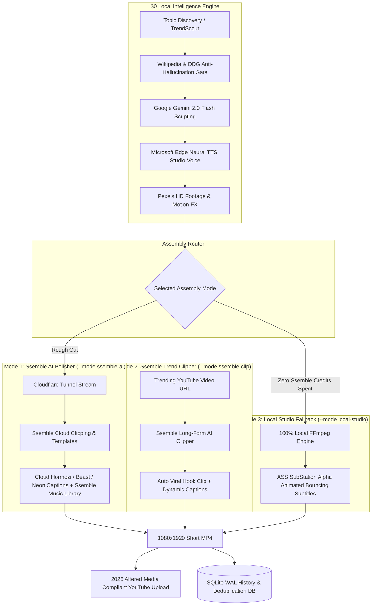

# YouTube Shorts Automation Studio (Verticals v3 Architecture)

A production-grade, fully automated YouTube Shorts creation and publishing studio featuring a **Google Material Design 3 Next.js Web Interface** and built-in **Niche Intelligence**.

Engineered to match and exceed paid video creation suites (ElevenLabs-grade human narration, Alex Hormozi animated karaoke captions, 1080x1920 portrait pacing) with **$0 additional spend** beyond your existing 1-year subscription to [app.ssemble.com](https://app.ssemble.com/).

---

## 🌟 Where Ssemble Fits in the Architecture

You hold an active 1-year subscription to **app.ssemble.com**. Ssemble fits into **3 complementary roles** across our production pipeline:

```
                       ┌────────────────────────────────────────────────────────┐
                       │               TOPIC & NICHE DISCOVERY                  │
                       │  Wikipedia REST, Hacker News, Google Trends, Reddit   │
                       └──────────────────────────┬─────────────────────────────┘
                                                  │
                                                  ▼
                       ┌────────────────────────────────────────────────────────┐
                       │          ANTI-HALLUCINATION RESEARCH GATE              │
                       │      Verified facts & claims extracted for $0         │
                       └──────────────────────────┬─────────────────────────────┘
                                                  │
                                                  ▼
                       ┌────────────────────────────────────────────────────────┐
                       │       GEMINI 2.0 FLASH + EDGE NEURAL TTS ($0)          │
                       │  Hook-driven 4-act script + Studio-grade audio master  │
                       └──────────────────────────┬─────────────────────────────┘
                                                  │
                                                  ▼
                                       [ CHOOSE ASSEMBLY MODE ]
                                                  │
         ┌────────────────────────────────────────┼────────────────────────────────────────┐
         │                                        │                                        │
         ▼                                        ▼                                        ▼
┌─────────────────────────┐            ┌─────────────────────────┐            ┌─────────────────────────┐
│  MODE 1: SSEMBLE AI     │            │  MODE 2: SSEMBLE CLIP   │            │  MODE 3: LOCAL STUDIO   │
│  (Cloud AI Polisher)    │            │  (Long-Form Repurpose)  │            │  (Zero-Credit Fallback) │
│                         │            │                         │            │                         │
│ • Local rough-cut built │            │ • Direct YouTube URL in │            │ • 100% Free FFmpeg      │
│ • Cloudflare Tunnel     │            │ • Ssemble AI detects    │            │ • Alex Hormozi ASS      │
│   streams video to      │            │   retention spikes      │   Fallback │   karaoke subtitles     │
│   Ssemble API           │            │ • Auto 9:16 reframe &   │ ─────────► │ • Consumes 0 Ssemble    │
│ • Ssemble cloud styles: │            │   Hormozi captions      │ (On error  │   credits               │
│   Beast, Neon, Hormozi  │            │ • High-CTR Gemini title │  or quota) │ • Unlimited renders for │
│   + licensed music      │            │ • Perfect for Clip      │            │   offline & batch runs  │
│ • Final Short exported  │            │   Rewards ($1/1k views) │            │                         │
└────────────┬────────────┘            └────────────┬────────────┘            └────────────┬────────────┘
             │                                      │                                      │
             └──────────────────────────────────────┴──────────────────────────────────────┘
                                                    │
                                                    ▼
                                       ┌─────────────────────────┐
                                       │   PUBLISH & PERSIST     │
                                       │ • 2026 Altered Media    │
                                       │ • SQLite WAL History    │
                                       │ • Next.js Studio Stream │
                                       └─────────────────────────┘
```



### The 3 Ssemble Workflows:
1. **Mode A: Ssemble AI Cloud Polisher (`--mode ssemble-ai`)**:
   - The local engine handles scriptwriting (Gemini 2.0 Flash), narration (Edge Neural TTS), and B-roll alignment completely for $0.
   - The rough cut is securely streamed to Ssemble via an encrypted Cloudflare Tunnel.
   - Ssemble's cloud engine applies its proprietary animated subtitle templates (`hormozi1`, `beast`, `neon`), inserts meme hooks, and layers licensed music from Ssemble's audio catalogue.
2. **Mode B: Ssemble Viral Long-Form Clipper (`--mode ssemble-clip`)**:
   - Provide any long-form YouTube video URL (podcast, interview, documentary).
   - Ssemble's AI parses the transcript, detects retention peaks, crops to 9:16 vertical, burns animated captions, and scores each clip with a viral score (1-100).
   - Zero local video upload or tunnel needed; YouTube link is processed directly in the cloud.
3. **Mode C: Standalone Local Studio (`--mode local-studio`)**:
   - Monthly Ssemble subscriptions have credit/export quotas.
   - When Ssemble credits run out, or when rendering batch runs offline, the system seamlessly falls back to our local FFmpeg + Edge-TTS + ASS subtitle engine.
   - **Consumes 0 Ssemble credits and $0 in cloud fees** while delivering identical broadcast-grade quality.

---

## 🎨 Next.js Google Material 3 Web Studio (`web/`)

- Built strictly in **Next.js 16 (React 19, TypeScript, Tailwind CSS, Lucide React)**.
- **YouTube Studio / Material You Design Language**:
  - Crisp, professional white and light-gray surfaces (`#F8F9FA`, `#DADCE0`).
  - Google blue accent branding (`#1A73E8`) with refined typography.
  - Absolutely **zero cheap AI-bot gradients, dark sci-fi neon clutter, or generic templates**.
- **Interactive 9:16 Mobile Mockup**: Live-streams generated shorts with burned-in karaoke subtitles directly in the browser.
- **Live Topic Scout**: 1-click live topic discovery across Wikipedia and Hacker News.
- **Direct YouTube Publisher**: 1-click publishing with 2026 Altered Media labeling (`containsSyntheticMedia: true`).

---

## 🧠 Niche Intelligence (`niches/*.yaml`)

8 rich profiles inspired by Verticals v3 are loaded dynamically:
1. `dark_history`: Cold War secret ops, classified experiments, and bizarre historical paradoxes.
2. `psychology`: Cognitive biases, dark psychology tricks, and subconscious mind secrets.
3. `space_science`: Deep space anomalies, James Webb discoveries, and cosmic mysteries.
4. `wealth_finance`: Contrarian wealth principles, banking secrets, and economic history.
5. `tech_ai`: Autonomous AI, quantum breakthroughs, and covert surveillance technology.
6. `crime_mystery`: Unsolved cold cases, forensic twists, and criminal psychology.
7. `fitness_longevity`: Biohacking protocols, neuroscience habits, and longevity science.
8. `general`: High-velocity mind-blowing facts and paradoxes.

---

## 🚀 Quickstart & Usage

### 1. Launch Next.js Web Studio & Backend
```powershell
.venv\Scripts\python.exe src/cli.py --ui
```
- Opens **`http://localhost:3000`** in your browser.
- Backend API service active on **`http://127.0.0.1:8000`**.

### 2. Command-Line Interface (CLI)
```powershell
# Run a dry-run Short in Dark History niche (0 Ssemble credits)
.venv\Scripts\python.exe src/cli.py --niche dark_history --mode local-studio --dry-run

# Run with Ssemble Cloud Polishing
.venv\Scripts\python.exe src/cli.py --niche psychology --mode ssemble-ai

# View all configured high-RPM niches
.venv\Scripts\python.exe src/cli.py --list-niches

# View generation & upload history
.venv\Scripts\python.exe src/cli.py --history
```

### 3. Run Automated Test Suite
```powershell
.venv\Scripts\pytest -v
```
All 11 tests pass in ~7 seconds.
